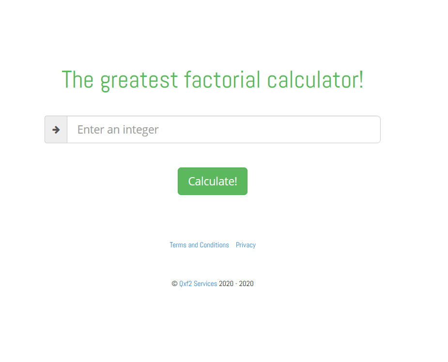

# Automation Code Challenge
## The gratest factorial calculator!

**Here are the instructions to run the project tests.**

**For the bug report go to [Bug Report](./bug-report/README.md).**

**For the api calls documentation go to [Api Calls](./api-calls/READMIN.MD).**

## Web Application



### Description: 

The main function of the system is calculate the factorial of the given number.

`https://qainterview.pythonanywhere.com/`

This image represents a simplified version of the system


## Instructions to Run the tests

**0. Pre-requisites**

  1. Have npm / [Node](https://nodejs.org/) version 12 and above
  2. Have [Cypress](https://docs.cypress.io/guides/getting-started/installing-cypress.html#System-requirements) installed on the system
  3. Have installed Firefox browser
  4. Open the project with VSCode or any other IDE

**1. Clone this project with** 

```bash
## clone this repot to a local directory
git clone https://github.com/krantos/code-challenge-factorial.git

## cd into the cloned repo
cd code-challenge-factorial

## install the node_modules
npm install
```

**2. Run the tests**

```bash
# run the e2e tests 
node tests/e2e-run-tests.js
```


**3. Generate the report**

To get the report, first we need to merge each reaport generated per each feature file. 

```bash
# merge the json report generated by mochawesom
npm run report:merge

# generate the report
npm run report:generate
```

Found the report in `./cypress/report/index.html`, and open it with a browser.


**4. Run the tests with the Cypress runner**

Open Cypress with

```bash
npm run cypress:open 
```


**Select the browser and then select the test to run**


**5. Generate a report for tests runned in the Cypress ui**

Generate the report with

```bash
# generate a report
npm run report
```

Find the output in `./cypress/cucumber-json/report/`
This is a different report from the previous one.


**6. Clean the reports and screenshots**

```bash
# clean the reports and screenshots
npm run report:clean
```

## Extra

Run a test with a mocked server in a headless browser with:

```bash
node tests/mocked-server.js
```

And get the report with
```bash
# merge the json results
npm run report:merge

# generate the report
npm run report:generate
```

Finally don't forget to clean the reports, if not, you will mix previous results.
```bash
# clean reports
npm run report:clean
```